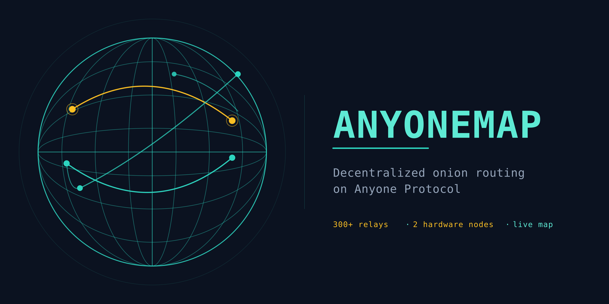

<p align="center">
  
</p>

# anyone-relay-map

Live, interactive map of the [Anyone Protocol](https://anyone.io) relay network — a decentralized onion routing network with staked relay operators. Built and operated by a community contributor running 300+ relays and 2 hardware nodes on the network.

**Live deploy:** [anyonemap.anyonerelaysmap.workers.dev](https://anyonemap.anyonerelaysmap.workers.dev/)

This repository contains the source for two Cloudflare Workers (`anyonemap-worker`, `anyclip-proxy`) plus the SPA they serve, the shared KV schema between them, a bitnodes snapshot mirror used by the Bitcoin comparison page, and the GitHub Actions automation that keeps it all running.

## What you can see on the live site

| Route | What it shows |
|---|---|
| [`/`](https://anyonemap.anyonerelaysmap.workers.dev/) | World map with 22-hub timezone strip, live relay positions, network health score, Anyone-vs-Tor stats |
| [`/bitcoin`](https://anyonemap.anyonerelaysmap.workers.dev/bitcoin) | Anyone for Bitcoin — privacy-preserving `bitcoin.conf` generator, live network comparison vs Tor |
| [`/style-guide`](https://anyonemap.anyonerelaysmap.workers.dev/style-guide) | Design tokens and component reference |
| [`/healthcheck`](https://anyonemap.anyonerelaysmap.workers.dev/healthcheck) | JSON status — worker version, KV bindings, snapshot freshness |

## Architecture

```
                ┌──────────────────────┐
                │   anyclip-proxy      │  Producer worker
                │   (67 API routes)    │  - /api/exit-relays
                │                      │  - /api/chat-* + many more
                │                      │  - cron: fp-index refresh
                └──────────┬───────────┘
                           │
                           │ JSON.stringify(snapshot)
                           │ validate against kv-schema.js
                           ▼
                ┌──────────────────────┐
                │   SNAPSHOT_KV        │  Shared KV namespace "anyonemap-rl"
                │   exit-relays:latest │  7-day TTL
                └──────────┬───────────┘
                           │
                           │ KV.get → validate → extract
                           ▼
                ┌──────────────────────┐
                │   anyonemap-worker   │  Consumer worker
                │                      │  - serves the SPA (index.html)
                │   ┌──────────────┐   │  - /bitcoin reads live KV data
                │   │  index.html  │   │  - /healthcheck, /sw.js, ...
                │   │  (1.7 MB SPA)│   │
                │   └──────────────┘   │
                └──────────────────────┘
                           ▲
                           │ inline at build time
                           │ via scripts/build-worker.js
                           │
                ┌──────────────────────┐
                │   worker-shell.js    │   ← source you edit
                │   index.html         │   ← source you edit
                │   kv-schema.js       │   ← source you edit
                └──────────────────────┘
```

## Repository layout

| Path | What it is |
|---|---|
| `worker-shell.js` | Source for the consumer worker — route handlers, KV reads, response framing. Gets combined with `index.html` + `kv-schema.js` to produce the deployable `anyonemap-worker.js`. |
| `index.html` | The SPA — 1.7MB single-file HTML+CSS+JS document, edited as a normal HTML file. |
| `kv-schema.js` | Canonical schema for the cross-worker KV contract (`SNAPSHOT_KV:exit-relays:latest`). Exposes `validate()`, `extract()`, field defs with type + required + sanity checks. |
| `anyclip-proxy-worker.js` | The producer worker. Self-contained, no build step. Contains an inlined copy of `kv-schema.js` between sentinel markers; CI verifies the copy matches canonical. |
| `anyonemap-worker.js` | **AUTO-GENERATED** — the deployable consumer worker, built from `worker-shell.js` + `index.html` + `kv-schema.js`. Do not edit by hand; CI will reject direct edits. |
| `scripts/` | Build pipeline + CI guards. See `Build pipeline` below. |
| `.github/workflows/` | CI: lint, schema-sync check, build-verify. |
| `data/` | The bitnodes snapshot mirror. See [`Bitnodes snapshot mirror`](#bitnodes-snapshot-mirror) below. |

## Build pipeline

The consumer worker is built from sources, not edited as a single megaline:

```bash
# Normal dev flow — auto-bumps WORKER_VERSION (e.g. v410 → v411) and builds
node scripts/build-worker.js worker-shell.js kv-schema.js index.html anyonemap-worker.js

# Check what the next version would be without changing anything
node scripts/build-worker.js worker-shell.js kv-schema.js index.html /tmp/preview.js --dry-run-bump

# Build without bumping (used by CI build-verify)
node scripts/build-worker.js worker-shell.js kv-schema.js index.html anyonemap-worker.js --no-bump
```

Then paste the built `anyonemap-worker.js` into the Cloudflare Workers dashboard and click "Save and deploy".

## CI guards

`.github/workflows/check-dupes.yml` runs on every push:

| Check | What it catches |
|---|---|
| `check-dupes.js` | Duplicate object-literal keys in worker source (e.g. two `Cache-Control` headers in one Response init — JS silent last-wins is a real bug class). |
| `check-schema-sync.js` | Drift between canonical `kv-schema.js` and the inlined copy in `anyclip-proxy-worker.js`. |
| `build-verify` | Rebuilds `anyonemap-worker.js` from source and verifies the HTML extracted from the committed artifact matches a fresh build. Catches the case where someone edited the built file directly without also updating sources. |

## KV schema (cross-worker contract)

The producer (anyclip-proxy) writes a snapshot to `SNAPSHOT_KV:exit-relays:latest` every time `/api/exit-relays` is hit. The consumer (anyonemap-worker) reads it for the live numbers on `/bitcoin`.

The contract is defined in [`kv-schema.js`](./kv-schema.js):

| Field | Type | Required | Notes |
|---|---|:---:|---|
| `cachedAt` | int | ✓ | Unix seconds. Sanity-checked: > 2024-01-01, ≤ now + 1y. |
| `exit_relays` | int | ✓ | Count of exit-flagged relays. |
| `bw_gbps` | number | ✓ | Aggregate exit bandwidth, gigabits/second. |
| `guard_relays` | int |   | |
| `middle_relays` | int |   | |
| `total_relays` | int |   | |
| `hardware_relays` | int |   | |
| `wallets` | int |   | |
| `zones` / `countries` / `isps` | object | null | Aggregations. |
| `source` | string |   | E.g. "fp-index", "request", "cached". |
| `fp_built_at` | int |   | Age of the fingerprint index. |

**Validation philosophy:** strict on writes, permissive on reads. The producer refuses to write invalid payloads (keeping the last known good snapshot in KV); the consumer reads whatever's there, logs warnings if the shape doesn't match, and falls back to em-dash placeholders for missing fields. This way no single bad write breaks the user-facing page, and bad data gets squeezed out as KV TTLs roll over.

## Bitnodes snapshot mirror

`data/bitnodes-snapshot.json` is a periodic mirror of bitnodes.io's snapshot data, used by the `/api/bitnodes` route to populate the Bitcoin comparison sections.

### Why this mirror exists

bitnodes.io is fronted by Cloudflare. The AnyoneMap worker runs on Cloudflare Workers. Cloudflare blocks Workers-to-Workers fetch traffic to other Cloudflare-protected sites unless explicitly allowlisted by the destination's owner — calls return HTTP 530 to the calling Worker. We can't change bitnodes.io's WAF rules, so the mirror routes around the block: GitHub Actions runners are not on Cloudflare's network, so they can fetch bitnodes.io normally. The runner saves the response into this repo, and the AnyoneMap worker fetches from `raw.githubusercontent.com` — which Cloudflare Workers can reach.

### Data sources

The snapshot in `data/bitnodes-snapshot.json` is populated by one of two paths:

- **Primary: bitnodes.io mirror.** `.github/workflows/bitnodes-mirror.yml` runs every 30 minutes, fetches `https://bitnodes.io/api/v1/snapshots/latest/` with a polite User-Agent, validates the response shape, and commits the result. This produces `total_nodes` in the ~20,000+ range with full bitnodes metadata.
- **Fallback: Bitcoin DNS seed servers.** When the primary path is unavailable for any reason — rate-limit exhaustion, upstream outage, or anything else that makes the bitnodes.io fetch unusable — a separate fallback path populates the snapshot from Bitcoin's public DNS seeds (the same `seed.bitcoin.sipa.be` / `seed.bitnodes.io` / `dnsseed.bluematt.me` set that Bitcoin Core uses to discover initial peers). This produces a smaller snapshot (typically ~100 nodes) with `"source": "dns-seeders"` and IP-based geolocation rather than bitnodes' richer per-node data.

You can tell which path produced the current snapshot by reading the `source` field at the top of the JSON: `"source": "bitnodes-mirror"` for the primary, `"source": "dns-seeders"` for the fallback. (If the field is absent in older commits, it's a primary-path snapshot from before the fallback was added.)

### How the primary mirror works

`.github/workflows/bitnodes-mirror.yml` on a 30-minute cron:

1. `curl` to `https://bitnodes.io/api/v1/snapshots/latest/` with a polite User-Agent
2. Validate the response is JSON with the expected shape
3. Commit the result to `data/bitnodes-snapshot.json` if it differs from the previous version (it always will — bitnodes updates the `timestamp` field on every snapshot)
4. Push the commit

The worker then fetches: `https://raw.githubusercontent.com/testmodeanyone-bit/anyone-relay-map/main/data/bitnodes-snapshot.json`

### Operational notes

- **Cron jitter:** GitHub Actions queues cron triggers; expect 5–30 minutes of late firing under load. The worker's 30-min KV refresh with stale-while-revalidate handles this fine.
- **Upstream errors:** if bitnodes.io returns non-200, the workflow skips the commit and exits cleanly. The last-good snapshot remains in the repo and the worker keeps serving it. Missing commits in the history are the signal that something went wrong.
- **Rate limits:** bitnodes.io rate-limits unauthenticated requests to 10/day per IP. GitHub Actions runners share IPs across many projects, so 429 is occasionally possible. The workflow treats 429 as a skipped run, same as any other non-200.
- **Validation:** the workflow refuses to commit a primary-path snapshot with fewer than 1000 nodes — a real Bitcoin network snapshot has ~20,000+. This protects against partial/corrupted responses publishing to consumers. The fallback path uses its own (lower) threshold because DNS seeds return far fewer entries by design.

### Triggering manually

The workflow has `workflow_dispatch:` enabled, so you can also run it on demand from the GitHub Actions tab. Useful right after creating the repo (so the first snapshot lands without waiting for the next cron tick).

### Schema

The committed JSON matches bitnodes.io's API response shape, plus an optional `source` field added by the fallback path:

```json
{
  "timestamp": 1779120000,
  "total_nodes": 22847,
  "latest_height": 925545,
  "source": "bitnodes-mirror",
  "nodes": {
    "203.0.113.5:8333": [
      70016,
      "/Satoshi:26.0.0/",
      1764082507,
      1033,
      925545,
      "203.0.113.5",
      8333,
      "US",
      40.7128,
      -74.0060,
      0,
      0,
      "DigitalOcean",
      "New York"
    ]
  }
}
```

### Top-level fields

| Field | Type | Notes |
|---|---|---|
| `timestamp` | int | Unix seconds when the snapshot was generated by the source. Changes every commit. |
| `total_nodes` | int | Total node count in the snapshot. |
| `latest_height` | int | Latest block height observed across the snapshot. May be 0 on the fallback path. |
| `source` | string | `"bitnodes-mirror"` or `"dns-seeders"`. Optional in older commits; assume primary if absent. |
| `nodes` | object | Map of `"<address>:<port>"` → 14-element array (see table below). |

### Node array field index reference

Each entry in `nodes` is keyed by `"<address>:<port>"` and maps to a 14-element array. **The index numbers below are load-bearing** — the AnyoneMap worker reads several of these by position, and getting one wrong silently corrupts the field's meaning (e.g., reading index 6 as "city" would store the port number 8333 as the city name on every node).

| Index | Field | Type | Example | Read by worker? |
|:---:|---|---|---|---|
| 0 | protocol version | int | `70016` | No |
| 1 | user agent | string | `/Satoshi:26.0.0/` | Yes (`ua`) |
| 2 | last seen | int | `1764082507` | No |
| 3 | services bitmask | int | `1033` | No |
| 4 | block height | int | `925545` | No |
| 5 | host | string | `203.0.113.5` | No |
| 6 | port | int | `8333` | No |
| 7 | country code | string | `US` | Yes (`cc`) |
| 8 | latitude | float | `40.7128` | Yes (`lat`) |
| 9 | longitude | float | `-74.0060` | Yes (`lon`) |
| 10 | timezone offset | int | `0` | No |
| 11 | ASN | int | `0` | No |
| 12 | organization | string | `DigitalOcean` | Yes (`org`) |
| 13 | city | string | `New York` | Yes (`city`) |

The worker's `scheduled()` handler iterates this array, validates that indices 7/8/9 are present, and emits `{lat, lon, cc, city, org, ua}` objects into the country-bucketed snapshot that the dashboard renders. Other indices are read but not currently surfaced.

**Warning:** if you change the index of a field, the worker will silently start storing the wrong data on the dashboard — the validation only catches missing-or-falsy values, not field-meaning drift. If you add new fields, append them to the end of the array; if you reorder existing ones, audit every consumer first.

## Contact

Issues and PRs welcome. For coordination on relay/node operation, reach out via the Anyone Protocol community channels.

## License

This repository's code is provided as-is for transparency about how the AnyoneMap deploy works. The live service operates under the AnyoneMap deployment's own terms.
